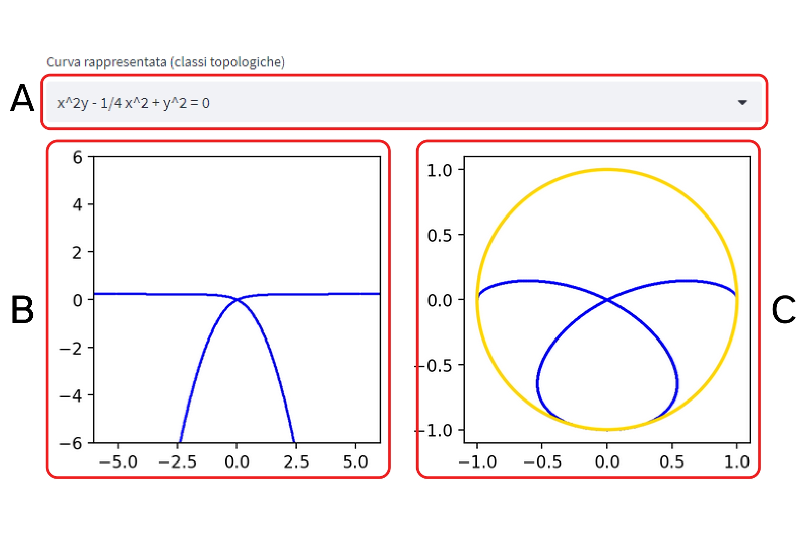

# Manuale

## A - Maschera di selezione curve
Da questo menù a tendina è possibile selezionare una curva per classe di equivalenza topografica che verrà poi rappresentata nei grafi sottostanti.

## B - Grafo del piano affine
La figura rappresenta la curva selezionata nell'area di piano affine tra il punto $(-6, -6)$ ed il punto $(6,6)$. Quest'area è stata scelta perché mostra i dettagli topologici caratteristici di tutte le curve.

## C - Grafo della chiusura proiettiva
La figura rappresenta la chiusura proiettiva della curva selezionata tramite il modello a disco. L'area rappresentata è quella tra il punto $(-1, -1)$ ed il punto $(1,1)$, ovvero l'area necessaria per contenere la circonferenza unitaria.