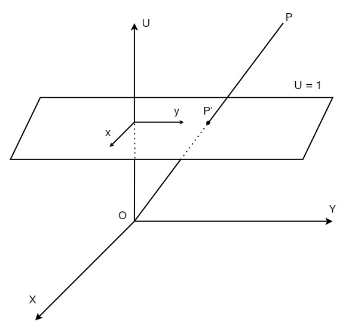
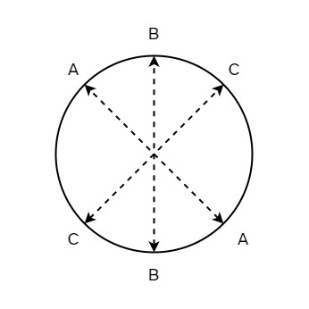
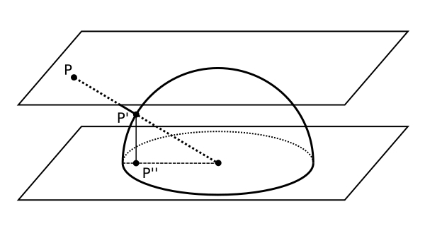
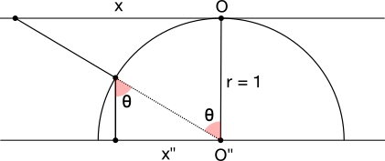
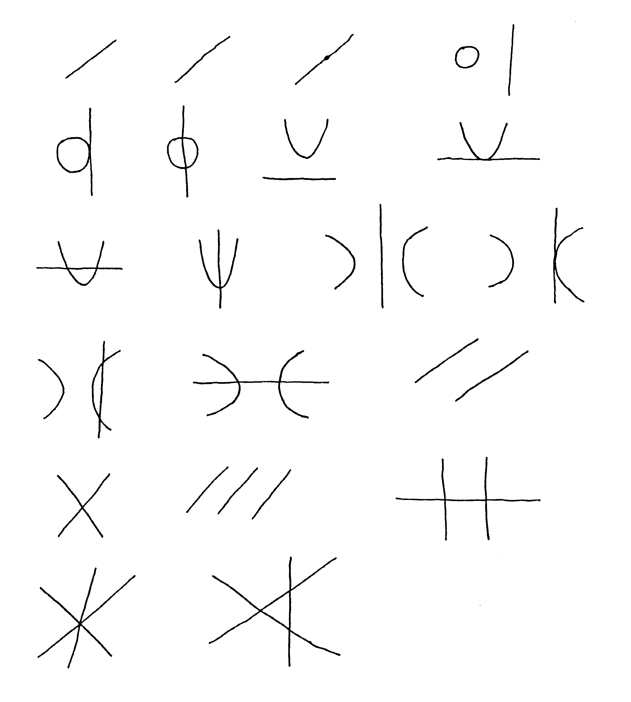

# Prospettiva e geometria proiettiva
La geometria proiettiva è un'estensione della geometria euclidea.
Mentre la geometria euclidea studia la forma degli oggetti planari e solidi che rimangono immutate da traslazioni, rotazioni e riflessioni (omotetie). La geometria proiettiva studia il modo in cui gli oggetti sono visti.
Un modello fisico per lo studio della prospettiva (lineare) è quello che include l'occhio (o centro di proiezione), il piano immagine e l'oggetto da osservare.
I punti proiettati sul piano vengono trovati tracciando una retta dall'occhio ad un punto sull'oggetto e calcolando l'intersezione con il piano.
Possiamo rappresentare questo modello nello spazio $\mathbb{E}^{3}$, chiamando gli assi X, Y e U. Poniamo il centro di proiezione all'origine O, il piano immagine sarà il piano affine di equazione $U = 1$, prendiamo $P$ come punto sull'oggetto osservato e chiamiamo $P'$ il punto proiettato. Se proiettiamo tutti i punti nello spazio, eccetto quelli appartenenti al piano $U = 0$ otterremo la chiusura proiettiva del piano immagine.

I punti appartenenti ad $U = 0$ sono detti impropri poichè non si intersecano mai con il piano immagine, avendo distanza infinita individuano delle rette $PO$ parallele al piano immagine e rappresentano una direzione al suo interno. Queste rette sono a loro volta dette rette improprie.

I punti propri, ovvero quelli con coordinata $U \not = 0$ possono essere specificati con le loro coordinate proiettive, con la seguente notazione $(X:Y:U)$. 
Le coordinate affini $(x,y)$ di $P'$ si determinano con le seguenti formule:

$$
  \begin{cases}
    \begin{aligned}
      x &= \frac{X}{U} \\
      y &= \frac{Y}{U}
    \end{aligned},\quad U\neq 0
  \end{cases}
$$

Dato che punti sulla stessa retta individuano lo stesso punto proiettato, coordinate proiettive uguali a meno di un fattore di proporzionalità indicano lo stesso punto $P'$.

$$
  (X:Y:U) \equiv \rho (X:Y:U) \quad con \quad \rho \in \mathbb{R}
$$

L'estensione che la geometria proiettiva fa alla geometria euclidea sono quindi questi punti impropri, che consentono di rappresentare quei punti dove le rette parallele si incontrano all'orizzonte.

# Rappresentazione della chiusura proiettiva su disco
Per visualizzare questi punti impropri (o punti ideali) possiamo immaginare una corrispondenza tra il piano euclideo e l'interno di un disco circolare. In questo modo i punti ideali si troveranno sul bordo del disco, disposti in modo tale che punti agli antipodi individueranno lo stesso punto ideale.

Per mappare un qualsiasi piano affine $\pi$ (eccetto $U = 0$), nello spazio interno al disco, faremo le seguenti operazioni per ciascun punto $P \in \mathbb{E}^{2}$:
- Proiettare $P$ su una semisfera di raggio unitario, trovando $P'$
- Proiettare $P'$ sul piano passante per il centro della semisfera e parallelo a $\pi$, trovando $P''$

Usando la trigonometria è possibile ricavare direttamente le coordinate $(x'',y'')$ di $P''$ a partire dalle coordinate $(x,y)$ di $P$, nel seguente modo:

$$
  \begin{cases}
    \begin{aligned}
      x'' &= \sin \arctan x \\
      y'' &= \sin \arctan y
    \end{aligned}
  \end{cases}
$$

Dove la formula per $x$ è stata ricavata dalle seguenti osservazioni:

# Curve cubiche

Le curve cubiche sono curve algebriche piane di grado tre, e hanno la forma: 
$$
Ax^3 + Bx^2y + Cxy^2 + Dy^3 + Ex^2 + Fxy + Gy^2 + Hx + Iy + J = 0
$$

## Classificazione affine
Sono presenti diverse possibili classificazioni di queste curve, ciascuna prende in considerazione gli invarianti rispetto a diverse trasformazioni. La classificazione che andremo a considerare è quella affine, ovvero quella che raggruppa le curve uguali a meno di una trasformazione affine nel piano.

Secondo questa classificazione sono presenti le seguenti curve non riducibili:

- $x^3 + xy^2 + x^2 + Hx + Iy + J = 0 \\ -∞ < H < ∞,\qquad 0 \leq I < ∞,\qquad -∞ < J < ∞$
- $x^3 + xy^2 + y + Hx + J = 0 \\ -∞ < H < ∞,\qquad -∞ < J < ∞$
- $x^3 + xy^2 + x + J = 0 \\ 0 \leq J < ∞$
- $x^3 + xy^2 + 1 = 0$
- $x^3 - xy^2 - x^2 + Hx + Iy + J = 0 \\ -∞ < H < ∞,\qquad -∞ < I \leq 0 ,\qquad -∞ < J < ∞$
- $x^3 - xy^2 + 1 = 0$
- $x^2y + y^2 - x + y + J = 0 \\ -∞ < J < ∞$
- $x^2y + y^2 + y + J = 0 \\ -∞ < J < ∞$
- $x^2y + y^2 - 1 = 0$
- $x^2y + y^2= 0$
- $x^2y - x + y + J = 0 \\ 0 \leq J < ∞$
- $x^2y - x = 0$
- $x^2y - x + 1 = 0$
- $x^2y + y + 1 = 0$
- $x^2y + 1= 0$
- $x^3 - y^2 + x + J = 0\\ -∞ \lt J \lt ∞$
- $x^3 - y^2 - x + J = 0\\ -∞ \lt J \lt ∞$
- $x^3 - y^2 + 1 = 0$
- $x^3 - y^2 = 0$
- $x^3 - y = 0$
- $x^3 - xy + 1 = 0$

> Weinberg, David A. "The topological classification of cubic curves." The Rocky Mountain Journal of Mathematics (1988): 655-664.

## Classificazione topologica
Un'altra classificazione interessante è quella topologica, ovvero quella che raggruppa le curve che presentano un omeomforismo nel piano.

In matematica, e più precisamente in topologia, un omeomorfismo è una particolare funzione fra spazi topologici che modella l'idea intuitiva di "deformazione senza strappi".

Secondo questa classificazione sono presenti 21 curve non riducibili, di cui andremo a tracciare la chiusura proiettiva nell'applicativo.

Le curve riducibili corrisponderebbero a combinazioni di curve algebriche piane di primo e secondi grado e pertanto non sono di nostro interesse.

> Weinberg, David A. "The topological classification of cubic curves." The Rocky Mountain Journal of Mathematics (1988): 665-679.